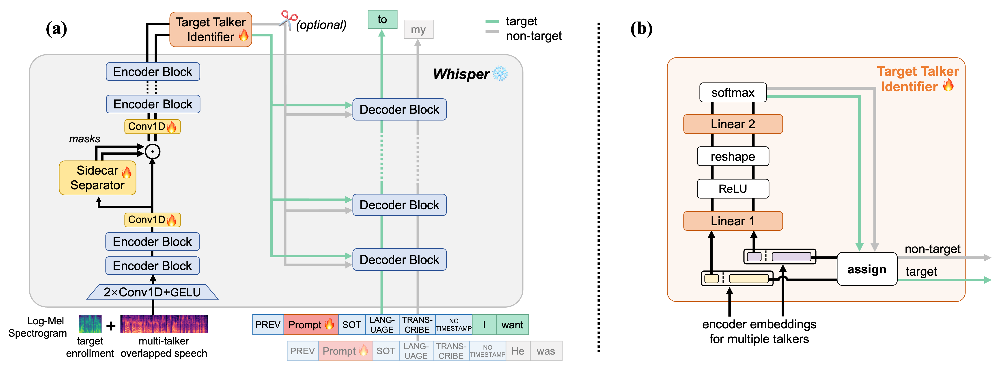

# Whisper-Sidecar

This repository is the open source code for our INTERSPEECH 2024 paper: 

**Empowering Whisper as a Joint Multi-Talker and Target-Talker Speech Recognition System**

https://www.isca-archive.org/interspeech_2024/meng24c_interspeech.html


## Data
### Overlapped multi-talker audio file generation
Please refer to:
- LibriMix: https://github.com/JorisCos/LibriMix
- LibriSpeechMix: https://github.com/NaoyukiKanda/LibriSpeechMix
- Aishell1Mix: https://github.com/huangzj421/Aishell1Mix

And organize the data list as jsonl files, such as `./Whisper-Sidecar/dataset/libri2mix_train.jsonl`

### For the Target Talker ASR Task on LibriMix and LibriSpeechMix
Please use the script `./Whisper-Sidecar/dataset/select_prompt_wav.py` to collect the enrolled prompt wav files under `./Whisper-Sidecar/dataset/enroll_audio`. 

The enrolled prompt audios will be concatenate with the overlapped speech with `DataCollatorSpeechSeq2SeqWithPadding`, if you set `--target_asr True` for the `finetune.py` and `evaluation.py` scripts.

## Usage

```
pip install -r requirements.txt
cd Whisper-Sidecar
torchrun --nproc_per_node=4 finetune.py   # training
python ./evaluation.py                    # evaluation
```

If you want to perform target-talker speech recognition, please set `--target_asr True` for `finetune.py` and `evaluation.py`.

## Related works
- **Insturction-based** multi-talker speech recognition with **large language model**
 [](https://arxiv.org/abs/2409.08596) [](https://github.com/cuhealthybrains/MT-LLM)
- Sidecar: Convert **single-talker** speech recognition systems to **multi-talker** [](https://arxiv.org/abs/2302.09908)
- Unified modeling of **multi-talker** speech recognition and **diarization** [](https://arxiv.org/abs/2305.16263)
- SA-CTC: A **speaker-aware CTC** for multi-talker overlapped speech recognition [](https://arxiv.org/abs/2409.12388)
 [](https://github.com/kjw11/Speaker-Aware-CTC)
- CSE-NET: A **SOTA network** architecture for multi-talker speech recognition
 [](https://arxiv.org/abs/2401.04152)
 [](https://github.com/kjw11/CSEnet-ASR)

## Citations
If you find our work inspiring or use our codebase in your research, please consider giving a star ⭐ and citations.

```
@inproceedings{meng2024whisper,
  title={{Empowering Whisper as a Joint Multi-Talker and Target-Talker Speech Recognition System}},
  author={Meng, Lingwei and Kang, Jiawen and Wang, Yuejiao and Jin, Zengrui and Wu, Xixin and Liu, Xunying and Meng, Helen},
  booktitle={Proc. INTERSPEECH},
  year={2024}
}
```
```
@inproceedings{meng2023sidecar,
  title={{A Sidecar Separator Can Convert a Single-Talker Speech Recognition System to a Multi-Talker One}}, 
  author={Meng, Lingwei and Kang, Jiawen and Cui, Mingyu and Wang, Yuejiao and Wu, Xixin and Meng, Helen},
  booktitle={IEEE ICASSP}, 
  year={2023}
}

```


## Acknowledgements
We have referenced a lot of code from the following two repositories:

- https://github.com/yeyupiaoling/Whisper-Finetune
- https://github.com/JusperLee/Conv-TasNet
